# 🤖 Auto_prd_test_expert


> **"从精准检索到智能共创，重塑测试用例生成体验。"**
本项目来源于字节训练营，个人结题项目，希望对尝试测开方向小伙伴们有一定的学习与帮忙
Auto_prd_test_expert 是一款基于 **“轻量化本地部署 + 企业级大模型 API”** 混合架构的智能测试助手。它采用 **Advanced RAG** 和 **Human-in-the-Loop** 闭环设计，解决了传统工具“各种幻觉”、“无法微调”、“流程割裂”的痛点，是一个具备记忆与质检能力的可进化测试管家。

---

## 🎯 一、项目背景与定位

### 1.1 行业痛点
在软件测试领域，测试人员长期面临以下挑战：
*   **🕒 文档理解耗时**：PRD（需求文档）冗长，人工提取测试点效率低。
*   **🕳️ 用例覆盖不全**：容易遗漏边界值、异常场景或安全隐患。
*   **♻️ 经验难以复用**：优质历史用例沉淀在文档坟墓中，无法自动联想。
*   **😵‍💫 AI 生成幻觉**：通用大模型不懂内部规范（如密码策略），生成内容“假大空”。

### 1.2 产品定位
构建 **“精准检索 -> 智能共创 -> 对抗评估”** 的完整闭环体系。
*   **精准检索**：漏斗式 RAG，拒绝噪音。
*   **智能共创**：多模态输入 + 双屏交互，支持持续 Fine-tune。
*   **对抗评估**：引入 AI Critic 角色，像 QA 专家一样对用例进行质检。

---

## 🚀 二、核心功能亮点

### 🛡️ 功能一：漏斗式 RAG 精准检索体系
> **解决痛点**：解决通用大模型不懂业务规范、引用内容包含噪音的问题。

*   **📥 输入**：非结构化资产（PDF/图片/历史用例） + 当前 PRD。
*   **⚙️ 处理 (The Funnel)**：
    1.  **智能切片 (Smart Chunking)**：基于滑窗机制将文档切分为细粒度语义片段。
    2.  **向量粗筛 (Vector Retrieval)**：利用 Embedding 快速召回 Top-K 相关片段。
    3.  **LLM 智能细筛 (Contextual Filtering)**：引入轻量级模型作为“过滤器”，剔除无关噪音（如背景介绍），只保留核心干货。
*   **📤 输出**：100% 纯净的核心知识上下文，并向用户**透明展示**引用的具体来源文件名。

### 🧠 功能二：多模态智能共创体系
> **解决痛点**：交互体验差、无法微调、视觉逻辑丢失。

*   **📥 输入**：多模态材料（PDF 文档、**UI 设计图**、补充文本）。
*   **⚙️ 处理**：
    1.  **视觉逻辑推导**：利用 Qwen 多模态能力识别 UI 元素（按钮/输入框）并推导交互逻辑。
    2.  **双屏共创交互**：
        *   *左侧（思维链）*：展示 AI 分析思路，支持多轮对话微调（Fine-tune）。
        *   *右侧（实时交付）*：动态渲染结构化表格，所见即所得。
    3.  **意图路由 (Intent Routing)**：自动识别用户是“闲聊”还是“修改指令”，动态切换 Prompt 策略。
*   **📤 结果**：
    *   支持 **CSV/Excel/YAML/JSON/Markdown** 五种格式一键导出。
    *   **资产回流**：确认后的用例可“归档”回知识库，成为下一次生成的“历史参考”。

### ⚖️ 功能三：智能对抗评估体系
> **解决痛点**：人工验收慢、缺乏标准度量。

*   **⚙️ 处理**：
    *   **独立评审 Agent (AI Critic)**：构建“QA 验收专家”角色，与生成者形成对抗。
    *   **多维质检**：覆盖率分析、逻辑自洽性检查、去重与规范性检测。
    *   **差异化比对**：若上传了标准用例 (Golden Sample)，自动计算偏差。
*   **📤 结果**：输出可视化的**质量评估报告**（包含评分、漏测点、优化建议）。

---

## 📸 Demo 展示

> *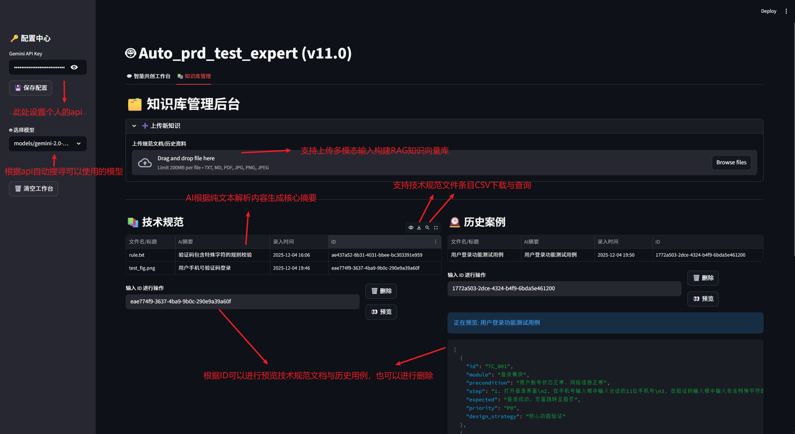*
> *   **图 1**: 上传多模态文件进行RAG向量库生成与UI前端可视化预览，搜寻、删除、下载与核心摘要生成
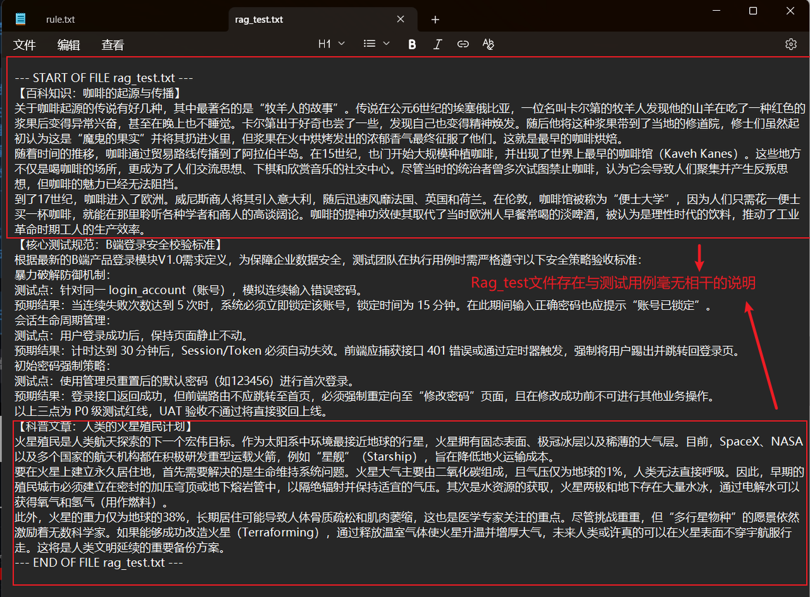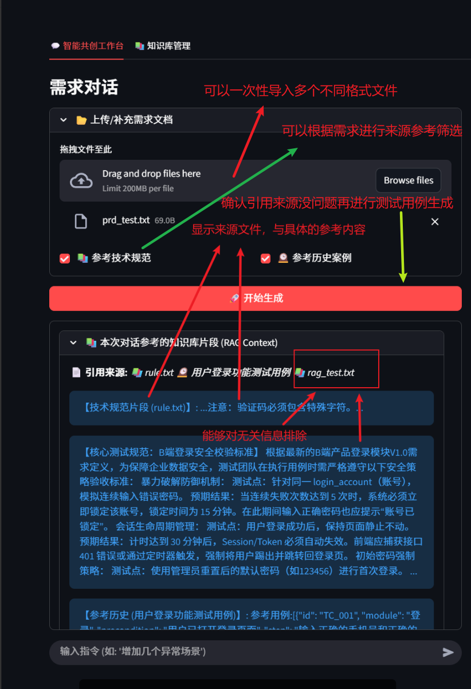
> *   **图 2**: 构建RAG知识库的污染文件与利用RAG知识库与LLM进行相关知识检索生成
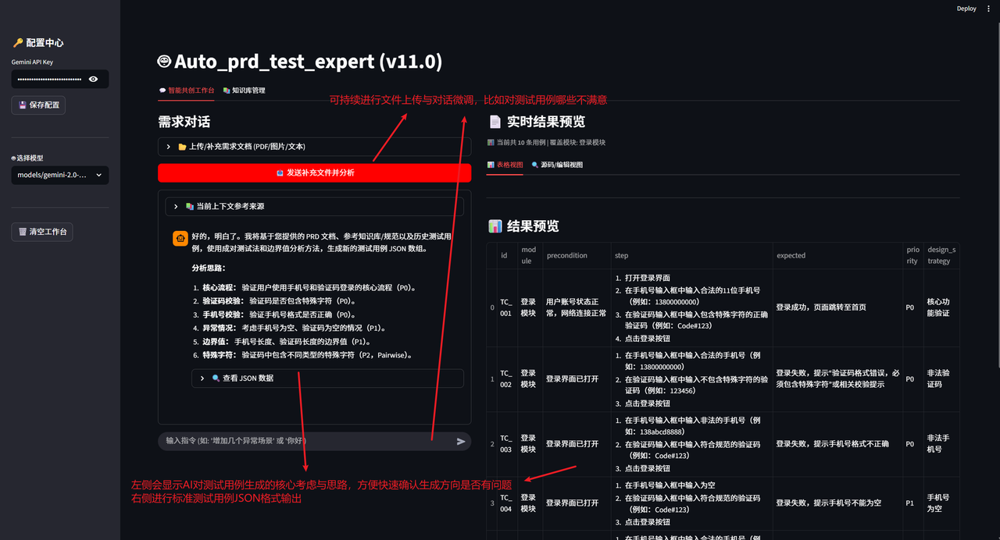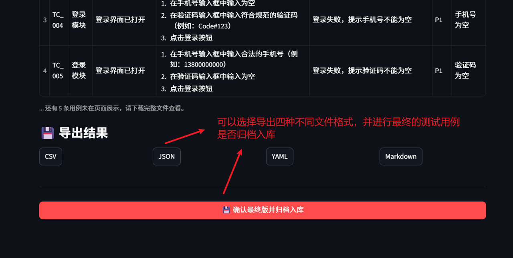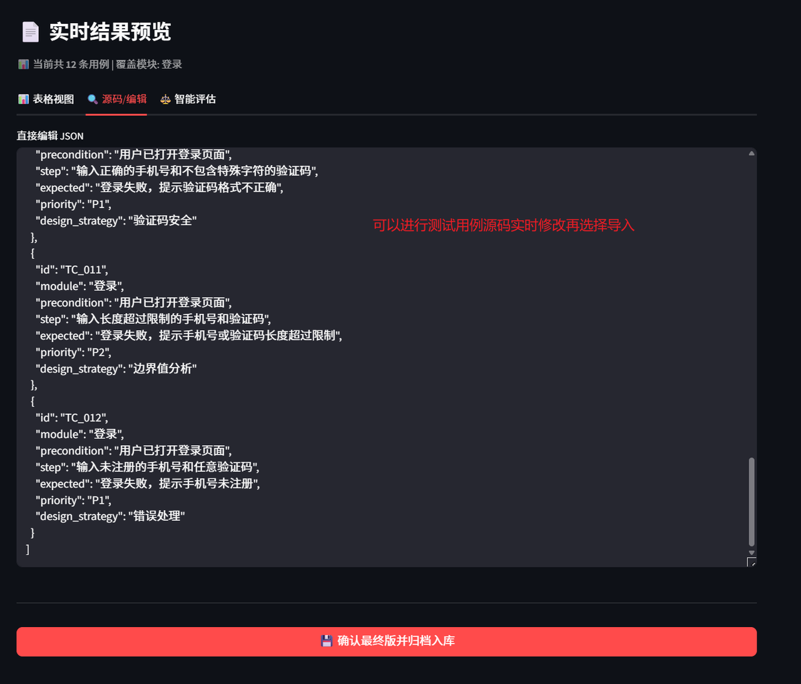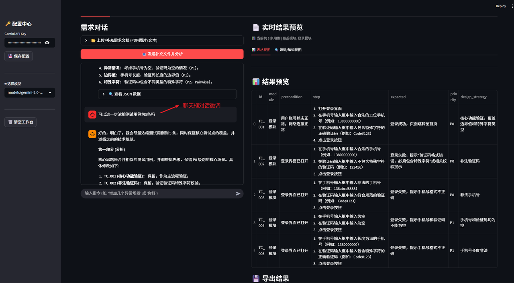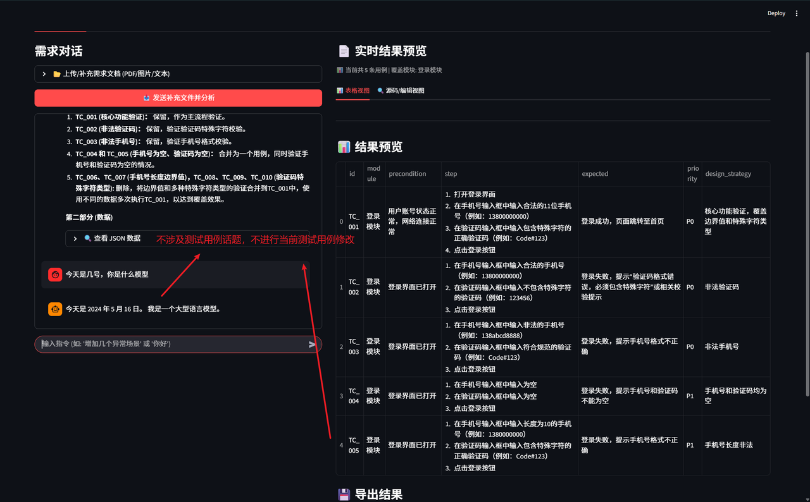
> *   **图 3**: 进行测试用例生成后人工微调、查看、多种格式下载、入库
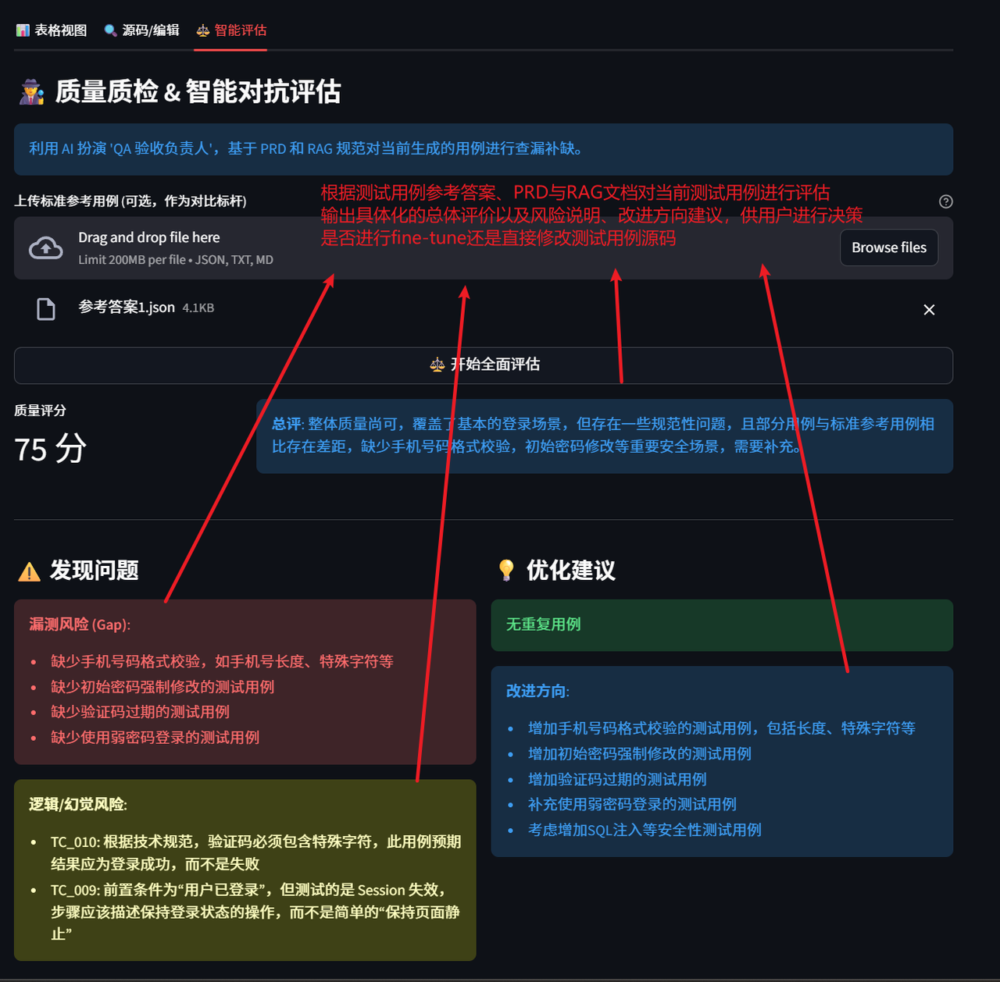
> *   **图 4**: 测试专家对测试用例评估效果展示
---

## 🛠️ 三、技术栈与架构

### 3.1 核心技术栈
| 模块 | 技术选型 | 理由 |
| :--- | :--- | :--- |
| **Lang** | **Python 3.10** | AI 领域标准语言，生态最丰富。 |
| **Frontend** | **Streamlit** | 专为数据科学设计，支持 `Session State` 状态管理与快速迭代。 |
| **Backend** | **OpenAI Compatible SDK (Qwen)** | 通过 OpenAI 兼容接口调用 Qwen 系列模型，支持强推理与多模态能力。 |
| **RAG DB** | **ChromaDB** | 轻量级本地向量数据库，无需服务器，保障**数据隐私**。 |
| **Data** | **Pandas** | 强大的数据清洗与格式转换能力 (JSON <-> DataFrame)。 |

### 3.2 核心代码模块说明

本项目采用模块化分层架构：

#### 📂 配置层 (`config/`)
*   **`prompts.py`**: 统一管理所有 Prompt。内置**智能路由逻辑**，根据用户意图动态组装 System Prompt，并强制执行“解释与数据分离”策略。

#### 📂 核心逻辑层 (`core/`)
*   **`rag_engine.py` (知识引擎)**: 封装 ChromaDB 操作。实现了 `TextSplitter` 递归切片算法，以及多模态解析接口 `parse_file_content`（支持 UI 图转文字）。
*   **`llm_client.py` (AI 网关)**: 封装 Qwen API（OpenAI 兼容），实现带历史记忆的对话接口 `get_qwen_chat_response`（兼容旧函数名）。
*   **`evaluator.py` (评估引擎)**: 独立的质检模块，负责调用 LLM 输出结构化的质量报告。

#### 📂 前端交互层 (`ui/`)
*   **`main.py` (主控台)**: 业务编排中心。
    *   **RAG 智能双重筛选**: 串联 `rag_engine` (粗筛) 与 `llm_client` (细筛/去噪)。
    *   **思维链共创**: 利用 `split_text_and_json` 实现左侧聊天流与右侧数据流的视觉分离。
    *   **资产归档**: 闭环逻辑，将最终用例回流至 ChromaDB。
*   **`sidebar.py`**: 全局配置入口，包含动态模型加载与 API Key 管理。
*   **`components.py`**: 专注于数据表格渲染与多格式导出。

---

## 🔮 四、未来展望

1.  **输入端拓展**：
    *   集成 **FastAPI**，支持飞书/钉钉机器人接入，实现 IM 群组中的“对话即测试”。
    *   增加 URL 解析能力（直接读取在线 PRD/Jira）。
2.  **输出端 Agent 化**：
    *   自动化脚本生成：利用生成的结构化数据，调用大模型生成 **Pytest / Midscene.js** 执行脚本。
    *   集成 CI/CD 流水线，实现“从文档到代码”的自动化闭环。
3.  **上游优化**：
    *   增加 **“PRD 质检”** 模块，在生成用例前先对需求文档本身进行逻辑漏洞分析。

---

## 🧭 Session State 学习地图（上传→生成→追问→评估→归档）

下面这张状态流转图对应 `ui/main.py` 的主链路，适合在二阶段学习时对照源码理解每个字段的生命周期。

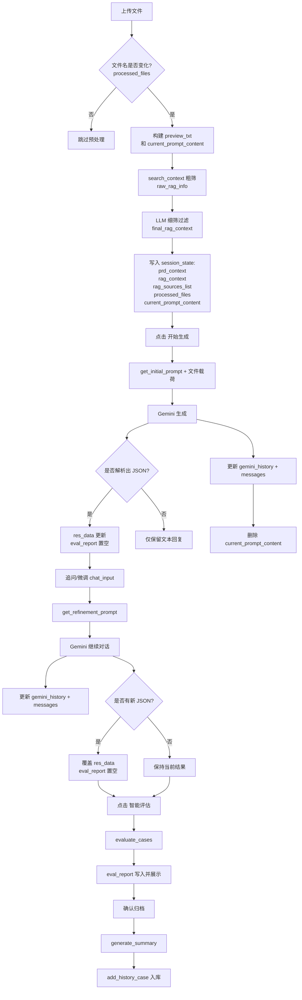

### 5 个关键点速记

1. **`messages` 与 `gemini_history` 分离**：
   前者服务 UI 展示，后者服务模型上下文记忆，避免展示逻辑污染模型历史。
2. **`res_data` 变化时清空 `eval_report`**：
   防止“新用例 + 旧评估”错配，确保评估结果永远对应当前数据。
3. **`processed_files` 防重复预处理**：
   文件名列表不变时，跳过 RAG 粗筛与细筛，减少重复调用。
4. **`rag_context` 是清洗后的结果**：
   检索原文是 `raw_rag_info`，经过过滤后才写入 `rag_context` 并参与后续生成。
5. **`current_prompt_content` 是一次性载荷**：
   用完即删，避免后续点击按钮时复用旧文件内容。

---

## 📥 安装与运行

## 🛠️ 一、 环境部署与配置

本项目提供 **Docker（推荐）** 和 **本地源码** 两种部署方式。由于项目依赖 Qwen API，请确保你的运行环境可访问对应接口。

### 🐳 方式一：使用 Docker 部署（推荐）

这是最简单、最稳定的部署方式，无需配置复杂的 Python 环境，且已配置好数据持久化。

#### 1. 前置准备
*   安装 [Docker Desktop](https://www.docker.com/products/docker-desktop/) (Windows/Mac/Linux)。
*   克隆本项目代码：
    ```bash
    git clone https://github.com/YourUsername/Auto_prd_test_expert.git
    cd Auto_prd_test_expert
    ```

#### 2. 配置 API Key
推荐使用环境变量（Docker/云环境）配置：

```bash
export QWEN_API_KEY="YOUR_QWEN_API_KEY_HERE"
export QWEN_BASE_URL="https://dashscope.aliyuncs.com/compatible-mode/v1"
export QWEN_MODEL_NAME="qwen-plus"
```
为了安全起见，API Key 不包含在代码库中。请按照以下步骤配置：
1.  进入 `data/` 目录。
2.  将 `user_config.example.json` 重命名为 `user_config.json`。
3.  编辑该文件，填入你的 Qwen API Key：
    ```json
    {
        "api_key": "YOUR_Qwen_API_KEY_HERE"
    }
    ```

#### 3. 配置网络代理（国内用户必读）
如果你在中国大陆地区使用，必须配置代理才能连接 Gemini API。
打开项目根目录下的 `docker-compose.yml`，找到 `environment` 部分，根据你的实际代理端口修改：

```yaml
    environment:
      # host.docker.internal 代表宿主机 IP
      # 请将 7897 修改为你本地代理软件（如 v2ray/clash）的端口号
      - HTTP_PROXY=http://host.docker.internal:7897
      - HTTPS_PROXY=http://host.docker.internal:7897
```
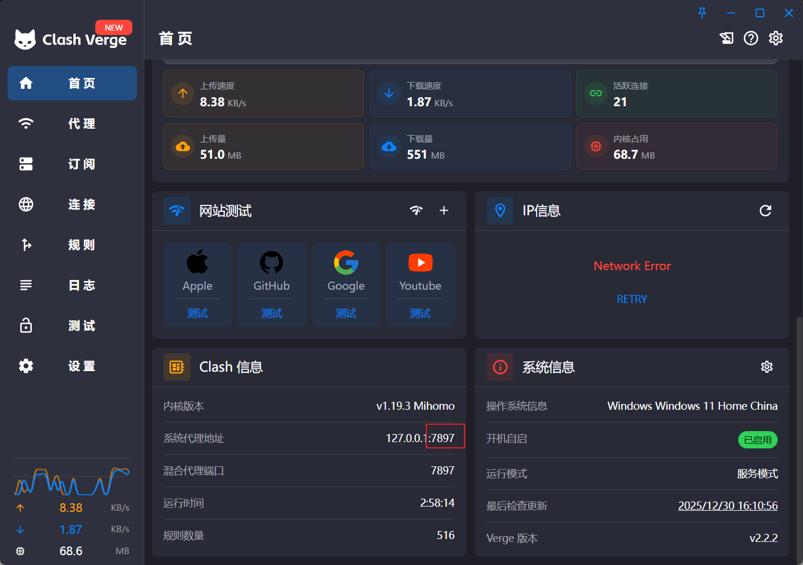
#### 4. 一键启动
在项目根目录下打开终端，运行：

```bash
docker-compose up -d --build
```

*   构建过程可能需要几分钟（已配置国内镜像源加速）。
*   启动成功后，浏览器访问：[http://127.0.0.1:8501](http://127.0.0.1:8501) 即可使用。

#### 5. 停止服务
```bash
docker-compose down
```
> **关于数据持久化**：Docker 已配置挂载卷，你的知识库（向量数据）和上传的原始文件会保存在本地 `data/` 目录下，重启容器数据**不会丢失**。

---

### 🐍 方式二：本地源码部署（开发调试）

如果你需要修改代码或进行二次开发，建议使用 Anaconda 环境。

#### 1. 创建虚拟环境
```bash
conda create -n gemini_test python=3.10
conda activate gemini_test
```

#### 2. 安装依赖
```bash
pip install -r requirements.txt
```

#### 3. 配置代理 (可选)
项目会自动读取系统环境变量。如果在代码中未检测到代理，默认会尝试使用 `http://127.0.0.1:7897`。你可以直接修改 `config/settings.py` 中的默认端口，或者在终端设置环境变量：
```bash
# Windows PowerShell
$env:HTTP_PROXY="http://127.0.0.1:7890"
$env:HTTPS_PROXY="http://127.0.0.1:7890"
```

#### 4. 启动应用
```bash
streamlit run ui/main.py
```
<<<<<<< ours


---

## 💻 二、在 VSCode 中使用 Docker 部署（你当前场景）

可以，完全可以在 VSCode 中直接完成 Docker 部署与调试。推荐按以下步骤操作：

### 1) 安装 VSCode 扩展
- **Docker**（微软官方）
- （可选）**Dev Containers**（如果你希望进入容器内开发）

### 2) 在 VSCode 打开项目根目录
确保打开的是包含 `Dockerfile` 和 `docker-compose.yml` 的目录。

### 3) 准备 API Key
在 `data/` 目录中创建（或重命名）`user_config.json`，内容示例：

```json
{
  "api_key": "YOUR_GEMINI_API_KEY_HERE"
}
```

> 说明：如果你更习惯环境变量，也可以在运行前设置 `GEMINI_API_KEY`。

### 4) 检查代理配置（国内网络重点）
编辑 `docker-compose.yml` 的 `HTTP_PROXY/HTTPS_PROXY`，将端口改为你本机代理端口（如 7890/7897）。

### 5) 在 VSCode 终端启动
在项目根目录执行：

```bash
docker-compose up -d --build
```

启动后访问：`http://127.0.0.1:8501`

### 6) 常用运维命令
```bash
# 查看容器状态
docker-compose ps

# 查看实时日志
docker-compose logs -f

# 重启服务
docker-compose restart

# 停止并删除容器
docker-compose down
```

### 7) 常见问题排查
- **页面打不开**：确认 8501 端口未被占用，且容器 `Up` 状态。
- **模型调用失败**：优先检查 API Key 和代理配置是否可访问 Google 服务。
- **改了代码没生效**：先 `docker-compose restart`；若依赖变化，执行 `docker-compose up -d --build` 重新构建。
=======
>>>>>>> theirs
